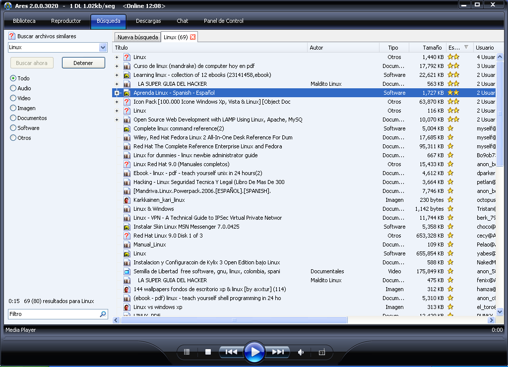
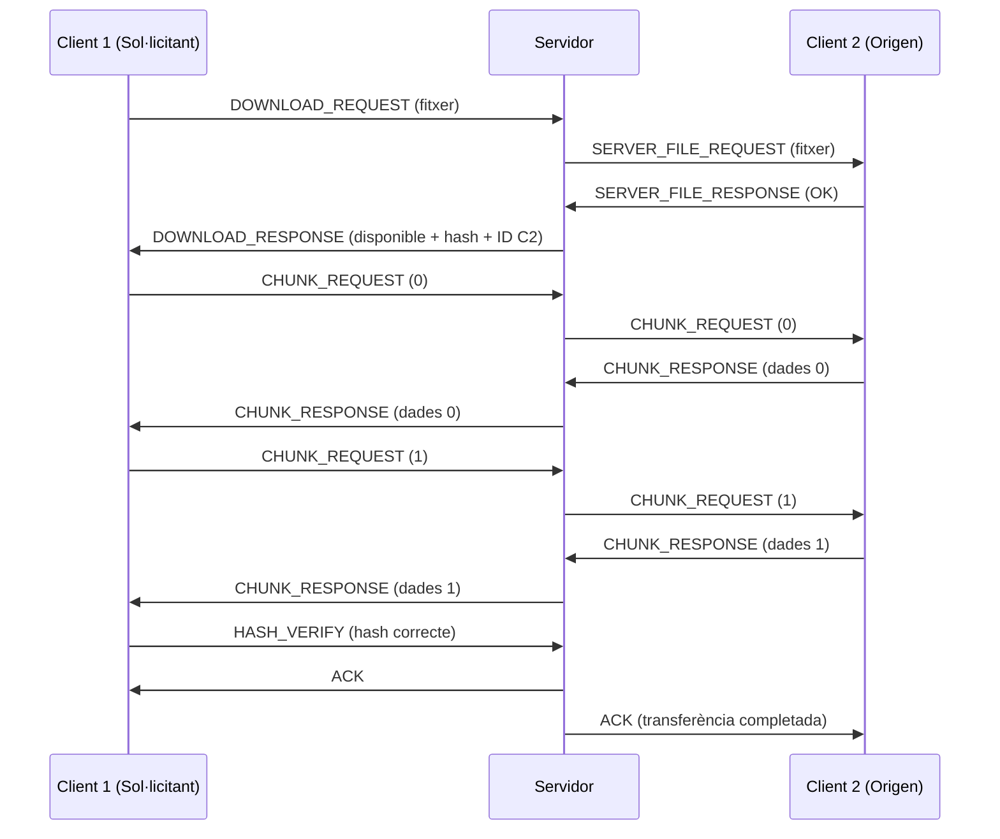
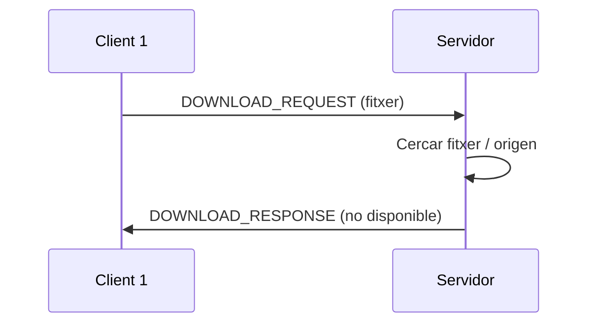
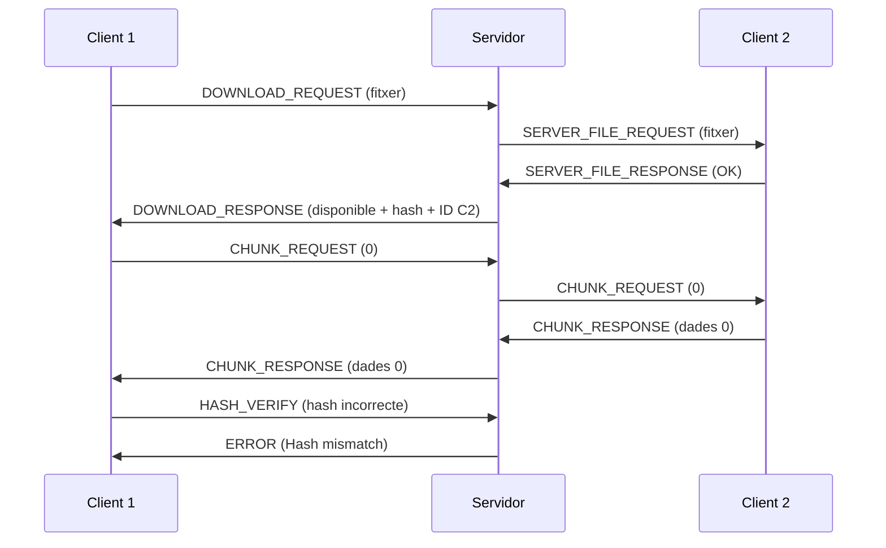

# Ares

Ares Galaxy és un programa de programari peer-to-peer (P2P) que s’utilitza per intercanviar i descarregar fitxers a través d’Internet. Permet als usuaris compartir música, vídeos, documents i altres tipus d’arxius directament entre ordinadors.

<figure>
  
  <figcaption>Programa Ares Galaxy (extret de <a href="https://es.wikipedia.org/wiki/Archivo:Ares_Galaxy_v2.0.PNG">devianart</a>)</figcaption>
</figure>

En el cas de la pràctica, definirem les següents particularitats pel nostre emulador d'Ares

- **Arquitectura de retransmissió client-servidor**: un servidor central coordina la descoberta de fitxers i retransmet les transferències entre clients  
- **Transferència de fitxers mediada pel servidor**: totes les transferències passen pel servidor (no hi ha connexió directa peer-to-peer)  
- **Cerca de fitxers**: permet cercar fitxers a tota la xarxa amb informació dels clients  
- **Anunci de fitxers**: els clients informen el servidor dels fitxers que tenen disponibles  
- **Identificació de fitxers basada en hash**: ús de hashing SHA-256 per verificar la integritat dels fitxers  
- **Transferència per fragments (chunks)**: els fitxers grans es transfereixen en fragments configurables (8 KB per defecte)

## Client

Un cop connectat, el client ha de poder admetre minim les comandes següents:

- `search <consulta>` – Cercar fitxers que coincideixin amb la consulta  
- `download <nom_del_fitxer>` – Descarregar un fitxer del servidor  
- `list` – Llistar tots els fitxers locals  
- `refresh` – Actualitzar i tornar a anunciar els fitxers locals  
- `quit` – Sortir del client 


## Tasques

El projecte conté marques TODO que indiquen les àrees que els estudiants han d’implementar:

### Implementació del protocol principal
- [ ] Serialització/deserialització de missatges 
- [ ] Lectura/escriptura de missatges 
- [ ] Càlcul del checksum 

### Implementació del servidor
- [ ] Gestió del registre de clients 
- [ ] Processament de l’anunci de fitxers 
- [ ] Gestió de les sol·licituds de cerca 

### Implementació del client
- [ ] Escaneig de fitxers amb càlcul del hash 
- [ ] Serialització de la llista de fitxers 
- [ ] Funcionalitat de cerca 
- [ ] Funcionalitat de descàrrega 


### Exemples de funcionament del protocol

#### Flux de descàrrega de fitxer (Client 1 del Client 2) 

El següent flux mostra el funcinament correcte de descarrega d'un fitxer entre un client i un altre.


#### Flux de fitxer no trobat (Client 1 del Client 2) 

El següent flux mostra el funcinament incorrecte degut a que el fitxer no es troba a l'origen, degut a diversos motius: el fitxer no es troba o el client s'ha desconectat



#### Flux de fitxer no verificat correctament
El següent flux mostra el funcinament incorrecte degut a que no es pot fer la verificació del hash del fitxer



## Mapa d'estats de cada actor
#### Client


A continuació es mostra la maquina d'estats del client

```Mermaid


stateDiagram-v2
    [*] --> Desconnectat

    Desconnectat --> Registrant: CLIENT_REGISTER
    Registrant --> Idle: ACK
    Registrant --> Error: ERROR

    Idle --> AnunciantFitxers: FILE_ANNOUNCE
    AnunciantFitxers --> Idle: ACK

    Idle --> Cercant: SEARCH_REQUEST
    Cercant --> Idle: SEARCH_RESPONSE

    Idle --> Sol·licitantDescarga: DOWNLOAD_REQUEST

    Sol·licitantDescarga --> Error: DOWNLOAD_RESPONSE (no trobat / origen no disponible / accés denegat)
    Sol·licitantDescarga --> RebentFragments: DOWNLOAD_RESPONSE (Status 0x00)

    RebentFragments --> RebentFragments: CHUNK_REQUEST/CHUNK_RESPONSE

    RebentFragments --> Verificant: tots els fragments rebuts

    Verificant --> Completat: HASH_VERIFY OK / ACK
    Verificant --> Error: HASH_VERIFY incorrecte / ERROR

```


#### Servidor

A continuació es mostra la maquina d'estats del servidor

``` Mermaid 
stateDiagram-v2
    [*] --> Esperant

    Esperant --> RegistrantClient: CLIENT_REGISTER
    RegistrantClient --> Esperant: ACK
    RegistrantClient --> Error: ERROR

    Esperant --> RebentAnunci: FILE_ANNOUNCE
    RebentAnunci --> Esperant: ACK

    Esperant --> ProcessantCerca: SEARCH_REQUEST
    ProcessantCerca --> Esperant: SEARCH_RESPONSE

    Esperant --> ProcessantDescarga: DOWNLOAD_REQUEST

    ProcessantDescarga --> Error: DOWNLOAD_RESPONSE (error)
    ProcessantDescarga --> ContactantOrigen: fitxer disponible

    ContactantOrigen --> Error: SERVER_FILE_RESPONSE (error)
    ContactantOrigen --> PreparatTransferencia: SERVER_FILE_RESPONSE (OK)

    PreparatTransferencia --> RetransmetentFragments: DOWNLOAD_RESPONSE Status 0x00

    RetransmetentFragments --> RetransmetentFragments: CHUNK_REQUEST / CHUNK_RESPONSE
    RetransmetentFragments --> VerificantHash: tots els fragments retransmesos

    VerificantHash --> Finalitzat: HASH_VERIFY OK / ACK
    VerificantHash --> Error: HASH_VERIFY incorrecte / ERROR

    Finalitzat --> Esperant
    Error --> Esperant
```