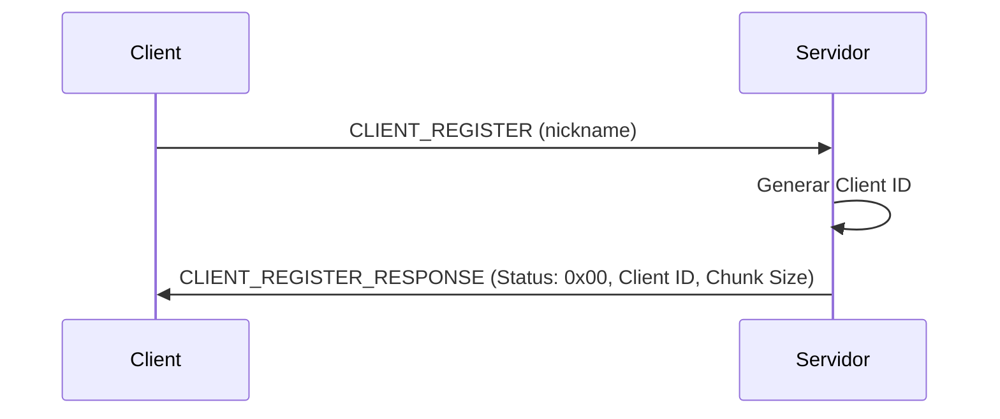
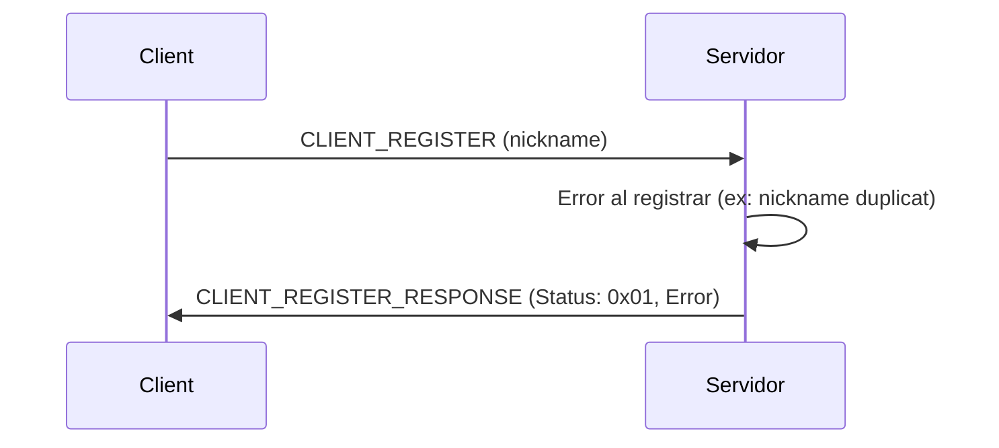
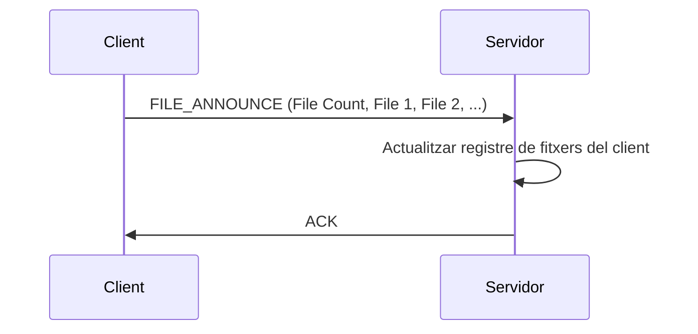
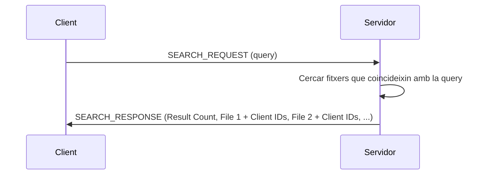
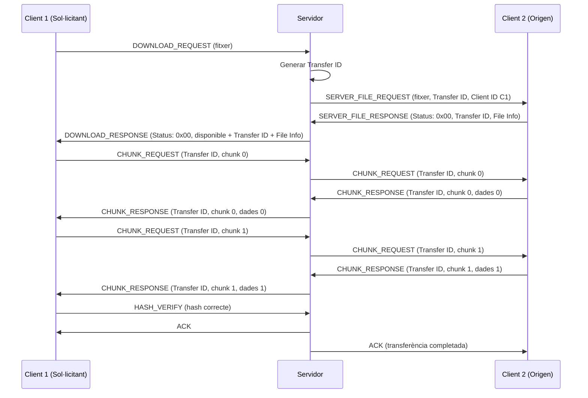
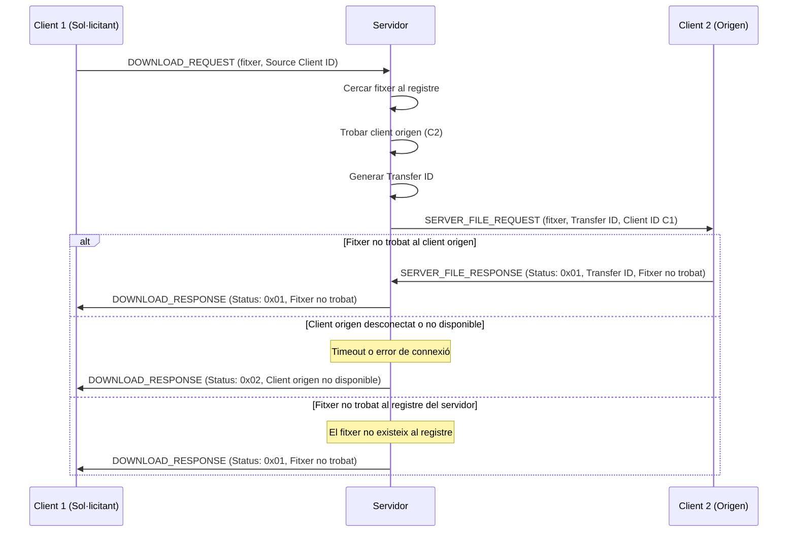
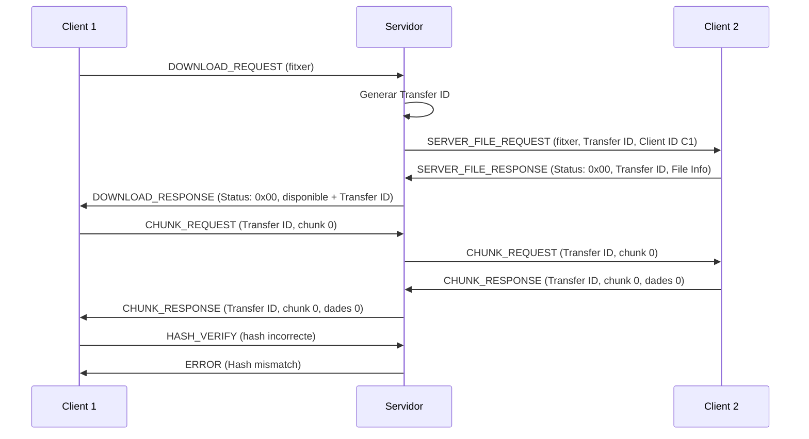
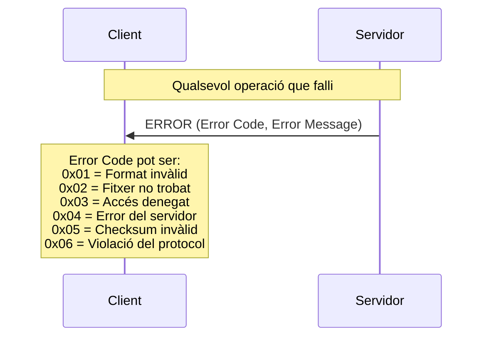

# Diagrames de casos d'us del protocol

#### Registre de client al servidor (èxit)

El següent flux mostra el funcionament correcte del registre d'un client al servidor.

#### Registre de client al servidor (error)

El següent flux mostra el funcionament quan el registre del client falla.

#### Anunci de fitxers

El següent flux mostra el funcionament de l'anunci de fitxers disponibles al servidor.

#### Cerca de fitxers

El següent flux mostra el funcionament de la cerca de fitxers al servidor.

#### Flux de descàrrega de fitxer (pel Client 1 del Client 2) 

El següent flux mostra el funcinament correcte de descarrega d'un fitxer entre un client i un altre.

#### Flux de fitxer no trobat (Client 1 del Client 2) 

El següent flux mostra el funcionament incorrecte degut a que el fitxer no es troba a l'origen, degut a diversos motius: el fitxer no es troba o el client s'ha desconectat.

#### Flux de fitxer no verificat correctament
El següent flux mostra el funcionament incorrecte degut a que no es pot fer la verificació del hash del fitxer

#### Resposta d'error estàndard

El següent flux mostra el funcionament d'una resposta d'error genèrica del protocol.

