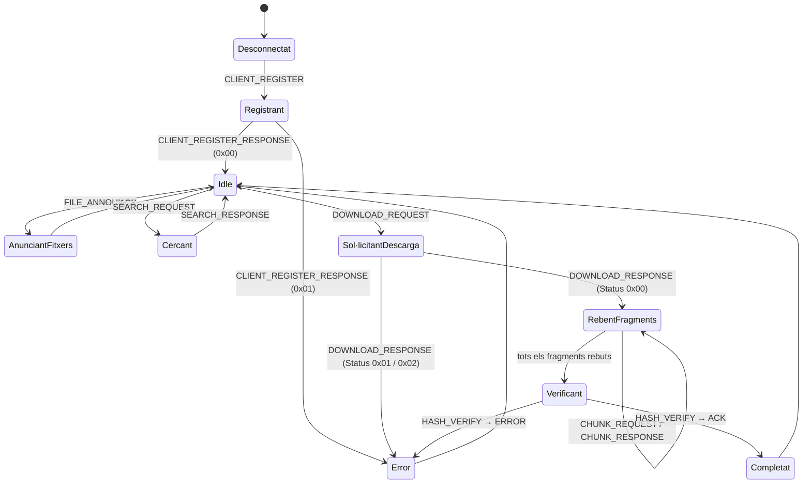
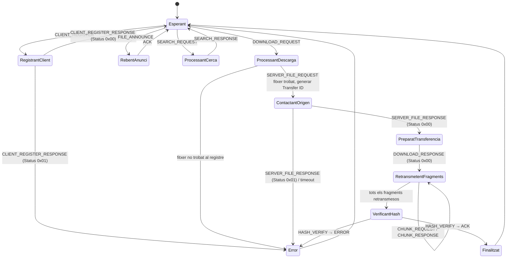

# Mapa d'estats

#### Client

```mermaid

stateDiagram-v2
    [*] --> Desconnectat

    Desconnectat --> Registrant: CLIENT_REGISTER
    Registrant --> Idle: CLIENT_REGISTER_RESPONSE (0x00)
    Registrant --> Error: CLIENT_REGISTER_RESPONSE (0x01)

    Idle --> AnunciantFitxers: FILE_ANNOUNCE
    AnunciantFitxers --> Idle: ACK

    Idle --> Cercant: SEARCH_REQUEST
    Cercant --> Idle: SEARCH_RESPONSE

    Idle --> Sol·licitantDescarga: DOWNLOAD_REQUEST

    Sol·licitantDescarga --> Error: DOWNLOAD_RESPONSE (Status 0x01 / 0x02)
    Sol·licitantDescarga --> RebentFragments: DOWNLOAD_RESPONSE (Status 0x00)

    RebentFragments --> RebentFragments: CHUNK_REQUEST / CHUNK_RESPONSE

    RebentFragments --> Verificant: tots els fragments rebuts

    Verificant --> Completat: HASH_VERIFY → ACK
    Verificant --> Error: HASH_VERIFY → ERROR

    Completat --> Idle
    Error --> Idle

```

#### Servidor

A continuació es mostra la maquina d'estats del servidor un cop s'ha connectat un client

```mermaid 
stateDiagram-v2
    [*] --> Esperant

    Esperant --> RegistrantClient: CLIENT_REGISTER
    RegistrantClient --> Esperant: CLIENT_REGISTER_RESPONSE (Status 0x00)
    RegistrantClient --> Error: CLIENT_REGISTER_RESPONSE (Status 0x01)

    Esperant --> RebentAnunci: FILE_ANNOUNCE
    RebentAnunci --> Esperant: ACK

    Esperant --> ProcessantCerca: SEARCH_REQUEST
    ProcessantCerca --> Esperant: SEARCH_RESPONSE

    Esperant --> ProcessantDescarga: DOWNLOAD_REQUEST

    ProcessantDescarga --> Error: fitxer no trobat al registre
    ProcessantDescarga --> ContactantOrigen: SERVER_FILE_REQUEST fitxer trobat, generar Transfer ID

    ContactantOrigen --> Error: SERVER_FILE_RESPONSE (Status 0x01) / timeout
    ContactantOrigen --> PreparatTransferencia: SERVER_FILE_RESPONSE (Status 0x00)

    PreparatTransferencia --> RetransmetentFragments: DOWNLOAD_RESPONSE (Status 0x00)

    RetransmetentFragments --> RetransmetentFragments: CHUNK_REQUEST / CHUNK_RESPONSE
    RetransmetentFragments --> VerificantHash: tots els fragments retransmesos

    VerificantHash --> Finalitzat: HASH_VERIFY → ACK
    VerificantHash --> Error: HASH_VERIFY → ERROR

    Finalitzat --> Esperant
    Error --> Esperant
```
