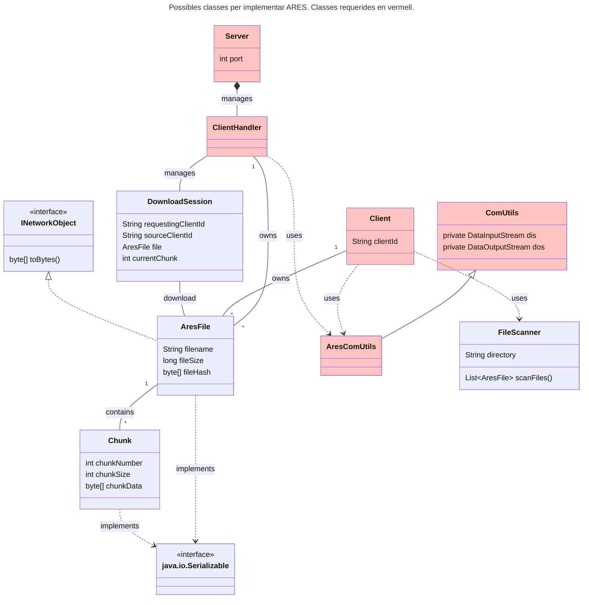

# Sessió 1

En aquesta sessió començarem a implementar el protocol de comunicació entre el __Client__ i el __Servidor__. Per a les communicacions utilitzarem **Sockets**, pel que us recomanem que reviseu la [documentació sobre Sockets en Java](https://docs.oracle.com/javase/7/docs/api/java/net/Socket.html).


## Objectius

- Resoldre els dubtes sobre el protocol i els missatges
- Entendre el concepte de socket
- Començar a implementar l'escriptura i lectura dels missatges del protocol
- Executar el codi proporcionat en múltiples màquines
- Creació de proves unitàries per provar els missatges


## Implementació d'ARES

L'implementació de la pràctica ha de seguir la guia d'estil de Java i es valorarà la qualitat en el codi, així com la seva organització. Teniu llibertat en com organitzar el codi, però si que hi ha una sèrie de classes que han d'existir. En el següent diagrama de classes us presentem una possible organització del codi en classes. N'hi ha que han d'existir obligatòriament, algunes ja us les donem com a part de l'enunciat, i es poden veure en **color vermell**. 




- **ClientHandler:** És la classe del servidor que es fa càrrec de la comunicació amb els clients. S'assignarà un nou **ClientHandler** a cada client que es connecti al servidor. Cada instància de **ClientHandler** s'executa en un Thread independent. Aquesta classe gestiona el registre de clients, l'anunci de fitxers, les cerques i les transferències de fitxers.

- **AresComUtils:** Aquesta classe ha d'especialitzar la classe **ComUtils** que us hem donat com a part de l'enunciat. Aquesta serà la classe que s'encarregarà de la lectura i escriptura a través del socket per a tots els missatges del protocol d'ARES. Per facilitar aquest procés, en [aquesta guia](../Guies/ComUtils.md) us proposem uns petits canvis en el codi facilitat de la classe **ComUtils**.

- **Server:** Classe principal del servidor que gestiona les connexions entrants i crea instàncies de **ClientHandler** per a cada client connectat. També manté el registre central de tots els clients i els seus fitxers disponibles.

- **Client:** Classe principal del client que gestiona la connexió amb el servidor, les comandes de l'usuari (search, download, list, refresh, quit) i coordina les operacions amb **FileManager** i **AresComUtils**.

## Escriptura i lectura de missatges

La classe `AresComUtils` ha d'implementar els mètodes d'escriptura que us permetin passar de la informació a alt nivell (enters, cadenes de caràcters, objectes, ...) a una seqüència ordenada de bytes que enviarem per la xarxa (escriurem al socket de sortida). També ha d'implementar els mètodes que us permetin llegir els bytes que van arribant al socket d'entrada i interpretar-los per recuperar la informació inicial.

Podem plantejar aquesta implementació de moltes maneres. Si ens fixem per exemple en el missatge `CLIENT_REGISTER` del protocol a [missatges](../Guies/missatges.md), caldrà tenir un mètode que el **client** utilitzarà per convertir el `clientId` a un conjunt de bytes que envià a través del socket cap al servidor, i un altre mètode que li permeti al servidor llegir els bytes del socket, identificar que es tracta d'un missatge de tipus `CLIENT_REGISTER` i recuperar el `clientId`.

En el primer cas, el **client** sap quin tipus de missatge vol escriure, i per tant el format exacte que té. En el segon cas, el **servidor** descobrirà el tipus de missatge en el moment que llegeixi el primer byte (**messageType**), i a partir d'aquell moment haurà d'actuar en conseqüència.


## Escriptura de proves unitàries

Per assegurar la codificació i recuperació dels missatges es fa correctament, us demanem que implementeu com a mínim una prova unitària per a cada missatge. En aquestes proves, simularem el **sockets** mitjançant un fitxer. Els passos són:

1. Crear una instància de la classe `AresComUtils` que utilitzi un fitxer en comptes de sockets.

```java
public class MyUnitTest {

    @Test
    public void my_message_test() {
        File file = new File("test");
        try {
            file.createNewFile();
            AresComUtils aresComUtils = new AresComUtils(new FileInputStream(file), new FileOutputStream(file));

            // Send data

            // Read data

            // Check data consistency with asserts       
        
        } catch (IOException e) {
            e.printStackTrace();
        }
    }
```

2. Utilitzar el mètode d'escriptura per enviar bytes.
3. Utilitzar el mètode de lectura per llegir els bytes enviats.
4. Comprovar que la informació rebuda és exctament la mateixa que hem enviat.

**Important** La classe ComUtils s'ha de modificar per a que AresComUtils pugui accedir als attributs de la classe mare. Per aixo consultar [ComUtils](../Guies/ComUtils.md).

**Nota:** Tingueu en compte que els missatges només comuniquen informació. Podeu implementar-los sense necessitat de tenir la lògica del joc implementada. El control d'errors no el fa la classe de comunicacions.

## Execució del codi en múltiples màquines

En la sessió anterior vàrem executar el servidor i el client en la mateixa màquina, però en terminals diferents. Vèiem que cada cop que executàvem el client, el servidor mostrava un missatge indicant que s'havia acceptat un nou client. En aquesta sessió l'objectiu és que repetiu l'execució, però fent que el client i el servidor estiguin en màquines diferents.

### Arrancant el servidor

En el cas del servidor, no hi haurà cap diferència respecte a la sessió anterior. Executarem el Servidor passant-li el port al qual volem que escolti. Per tal que els clients es puguin connectar, caldrà saber la IP de la màquina on està en execució el servidor. A continuació us resumim algunes de les opcions per trobar la adreça IP de la vostra màquina. Aquest serà el **host** que necessiten els clients per poder connectar.

#### Com obtenir l'adreça IP d'una màquina  

##### Windows  
1. Obre el **Símbol del sistema** (Cmd) prement `Win + R`, escrivint `cmd` i prement **Enter**.  
2. Executa la comanda següent:  
   ```sh
   ipconfig
   ```
3. Busca l'entrada Adreça IPv4 sota l'adaptador de xarxa en ús.

#### Mac

1. Obre el Terminal des de ```Aplicacions > Utilitats > Terminal```.
2. Executa la comanda següent:
```sh
ifconfig | grep "inet "
```
3. L'adreça IP local apareixerà després de inet (normalment associada a ```en0``` per Wi-Fi).

#### Linux
1. Obre un Terminal.
2. Executa la comanda següent:
```sh
ip a
```
3. Cerca la línia que conté ```inet```, que mostrarà l'adreça IP associada a la interfície de xarxa activa (normalment ```eth0``` o ```wlan0```).

### Arrancant el client

Per arrancar el **client** farem exactament el mateix que en la sessió anterior, però en comptes de ```localhost```, haurem de posar la IP obtinguda en el pas anterior. El funcionament hauria de ser exactament el mateix que teníeu en la sessió anterior.

## Treball fora del laboratori:
* Implementa tots els missatges del protocol
* Implementa com a mínim un test unitari per cada missatge
