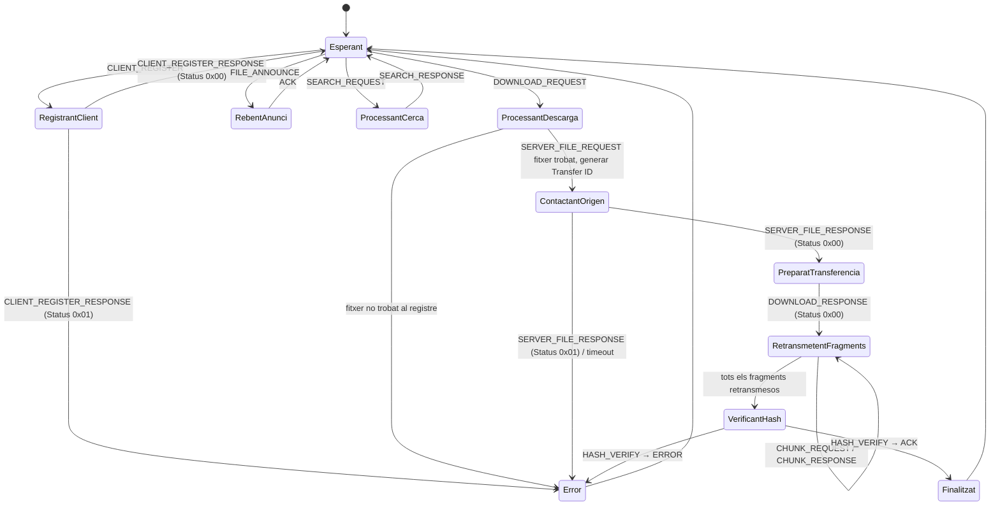

# Sessió 2

En aquesta sessió revisarem alguns detalls del protocol implementarem la maquina d'estats tant pel __Client__ com el __Servidor__. 


## Objectius

- Resoldre dubtes sobre el protocol i els missatges
- Entendre el concepte de socket
- Testejar l'escriptura i lectura dels missatges del protocol
- Executar el cicle de vida de l'aplicació en un entorn local i controlat
- Resolució d'errors de comunicació


## Implementació de la maquina d'estats

Un cop es tinguin els missatge serialitzats el següent pas es implmentar la maquina d'estats del protocol. Per començar ens fixarem en el servidor quan té ja un client conectat sense tenir en compte el threading encara

En aquest punt el servidor espera diferents tipus de missatges:
DOWNLOAD_REQUEST, FILE_ANNOUNCE, SEARCH_REQUEST, DOWNLOAD_REQUEST

caldra implemetar a la classe de clientHandler un flux que permeti passar d'un estat idle a un estat x. 

El mapa d'estats pel servidor es el següent:

#### Servidor

A continuació es mostra la maquina d'estats del servidor un cop s'ha connectat un client


El del client el podeu trobar a: [States](../Guies/States.md)

## Organització de codi

Hi ha moltes formes d'implementar una maquina d'estats, depenent de la complexitat del codi es millor fer-ho d'una manera o d'una altra. Teniu llibertat d'implementar-ho com volgueu pero us recomanem que definiu en un enum els diferents estats possibles:

```java
public enum ServerState {
    IDLE,
    REGISTRANT_CLIENT,
    PROCESSANT_CERCA,
    ...
    ERROR,
}
```

i que a traves d'un switch us mogueu d'un estat a un altre

```java
public class ClientHandler {

    private ServerState state = ServerState.CONNECTED;

    ...

    private void changeState(ServerState newState) {
    System.out.println("Transició: " + state + " -> " + newState);
    this.state = newState;
}
```

Existeixen formes mes elaborades com el state pattern https://en.wikipedia.org/wiki/State_pattern pero cal anar amb compte de no fer over engineering si el projecte no es complex.


## Gestió d'errors al socket

Fins ara ens hem centrat principalment en l'establiment de la connexió per part del __Client__ i la seva acceptació per part del __Servidor__. A través de la classe **ComUtils** (o la seva derivada **BattleshipComUtils**) hem utilitzat el socket de comunicació per tal d'intercanviar els missatges del protocol entre __Client__ i __Servidor__, però no ens hem parat a controlar les diferents situacions que ens podem trobar durant una partida. En concret, us demanem que:

- **timeout:** Cada cert temps (màxim 30 segons) s'ha de comprovar que la connexió segueix activa.
- **desconnexió:** S'ha de gestionar el cas en que la connexió es tanca. Si intentem escriure en una connexió tancada tindrem errors que cal gestionar, especialment en el cas del __Servidor__.
- **tancar el socket:** Quan un socket ja no sigui necessàri, caldrà tancar-lo per alliberar els recursos que està utilitzant.

Reviseu la documentació del **Socket** per veure quins mètodes teniu disponibles de cara a poder gestionar aquestes situacions. 

**Nota:** Per simplificar, no s'implementarà la reconnexió mitjançant el missatge **REJOIN**. En comptes d'això, si el __Client__ detecta que s'ha desconnectat del servidor, mostrarà un missatge a l'usuari indicant-ho i donant per finalitzada la partida. Si el __Servidor__ detecta que un __Client__ s'ha desconnectat, finalitzarà el **Thread** associat a aquest client i la partida (en cas de **multi jugador** haurà de notificar l'altre jugador de que la partida ha finalitzat i que n'és el guanyador).

### Treball fora del laboratori:

-  Finalitzar el que no s'hagi pogut realitzar durant la sessió de laboratori, finalitzar la maquina d'estats i començar a testerjar-la amb casos simples
- Implementar la gestio d'errors al socket
- Començar a mirar el funcionament de threads i thread safe lists dintre de Java

