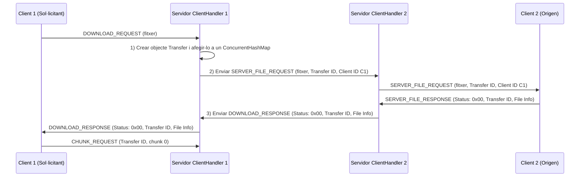

# Sessió 3

En aquesta sessió aprofundirem en alguns aspectes clau del treball amb sockets i completarem la implementació d’Ares, incorporant multithreading al servidor i l’ús d’objectes thread-safe per garantir la correcta gestió de la concurrència.

També revisarem possibles problemes habituals en entorns distribuïts, com ara la sincronització entre fils, la gestió de connexions i el control d’errors.


## Objectius

- Resoldre dubtes sobre la implementació de la màquina d’estats.
- Comprendre els principis bàsics del thread-safe programming.
- Aprendre a dissenyar i implementar un servidor multithread segur.
- Gestionar correctament sockets en un entorn concurrent i dinàmic.
- Aplicar bones pràctiques en la sincronització i compartició de recursos.

## Un servidor, un thread per cada client

Per tal que el servidor pugui gestionar múltiples clients simultàniament, cal crear un **fil d’execució (thread)** per a cada nova connexió entrant.

Cada client serà gestionat per una classe que implementi la interfície `Runnable`:

```java
public class ClientHandler implements Runnable {

    private final Server server;

    public ClientHandler(Server server, ...) {
        this.server = server;
    }

    @Override
    public void run() {
        // Lògica de comunicació amb el client
    }
}
```

D’aquesta manera, cada vegada que un nou client es connecta, es crea un nou `ClientHandler` i s’executa en un fil independent:

```java
public class Server {

    private final Map<Integer, ClientHandler> clientHandlers = new ConcurrentHashMap<>();

    public void init() throws IOException {
        ServerSocket serverSocket = new ServerSocket(8080);

        while (true) {
            Socket socket = serverSocket.accept();

            ClientHandler handler = new ClientHandler(socket, this);
            Thread clientThread = new Thread(handler);
            clientThread.start();
        }
    }
}
```

Aquest model permet que el servidor pugui atendre múltiples clients de manera concurrent.


## Objectes thread-safe i transferència de fitxers

Com que tindrem **un thread per cada client** des del servidor, és possible que dos fils diferents necessitin compartir informació.

Per exemple:

- El client **A** sol·licita un fitxer.
- El client **B** és l’origen del fitxer.
- Els dos `ClientHandler` corresponents hauran de comunicar-se i compartir estat.

Això implica:

- Compartir informació sobre transferències actives.
- Compartir inventaris de fitxers.
- Coordinar missatges entre fils.

Per garantir la seguretat en entorns multifil, utilitzarem `ConcurrentHashMap`.

`ConcurrentHashMap` és una implementació de la interfície Map dissenyada específicament per funcionar en entorns multithreaded, permetent accessos simultanis segurs sense necessitat de sincronització manual en la majoria de casos.

```java
private final ConcurrentHashMap<Integer, Transfer> transfers = new ConcurrentHashMap<>();
private final ConcurrentHashMap<String, FileInfo> fileRegistry = new ConcurrentHashMap<>();
```


## Seqüència d'inici d'una transferència




#### Comunicació entre ClientHandlers

Observem que en els passos 2) i 3) és necessari que un `ClientHandler` pugui invocar un altre `ClientHandler`.

Per tant, el servidor ha de mantenir una estructura que permeti accedir als handlers actius.

```java
private final Map<Integer, ClientHandler> clientHandlers;

public Server(int port) {
    this.port = port;
    this.fileRegistry = FileRegistry.getInstance();
    this.transferManager = TransferManager.getInstance();
    this.clientHandlers = new ConcurrentHashMap<>();
}
```

Això permet:

- Registrar cada `ClientHandler`
- Recuperar un handler concret
- Enviar missatges entre clients

## Inventari de fitxers i transferències

Atès que múltiples fils accediran a:

- L’inventari global de fitxers
- La llista de transferències actives

Cal que aquestes estructures també siguin **thread-safe**.

Per exemple:

```java
private final ConcurrentHashMap<Integer, Transfer> transfers;
private final ConcurrentHashMap<String, FileInfo> fileRegistry;
```
Això permet:

- Accés concurrent segur
- Insercions i consultes simultànies
- Evitar condicions de carrera (race conditions)


## Transferència de chunks

Un cop acceptada la transferència:

- El client sol·licitant envia `CHUNK_REQUEST`
- El servidor reenvia la petició a l’origen
- L’origen respon amb `CHUNK_RESPONSE`
- El servidor reenvia el chunk al sol·licitant

Aquest procés es repeteix fins completar la transferència.

Cada pas implica coordinació entre dos `ClientHandler`, utilitzant les estructures compartides (`ConcurrentHashMap`) per mantenir l’estat coherent.

## Proves

Per tal de realitzar les proves de la forma més ordenada us recomanem que genereu una estructura de directoris com la següent:

```
repo/
├── public/
│   └── [nickname]/
└── downloads/
    └── [nickname]/
```

on `public` contindrà els fitxers que cada client està disposat a publicar i a `downloads` s'emmagatzemen les baixades d'altres clients.


## Treball fora del laboratori:

- Finalitzar el que no s'hagi pogut realitzar durant la sessió de laboratori
- Definir els tests que es realitzaran a la sessió de tests
- Començar a redactar la memòria

